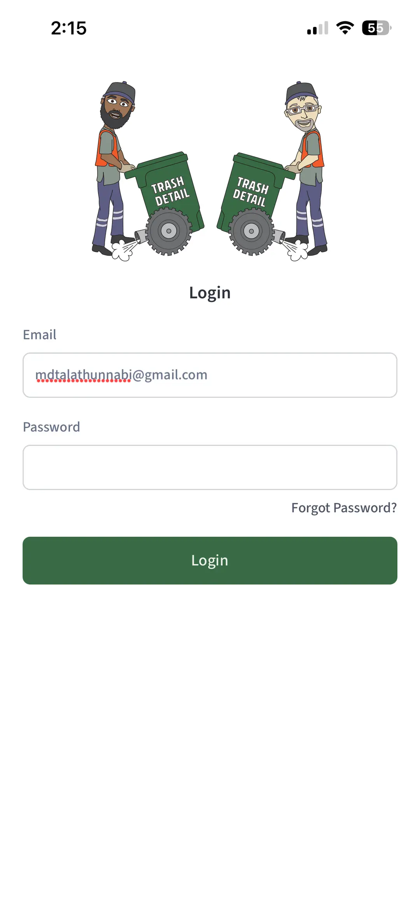
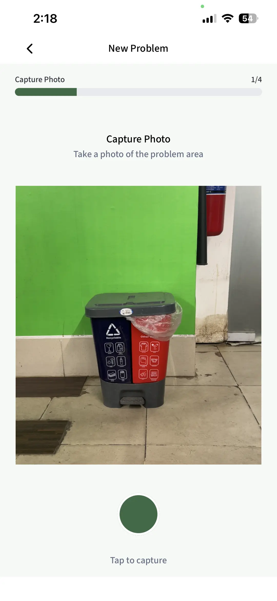
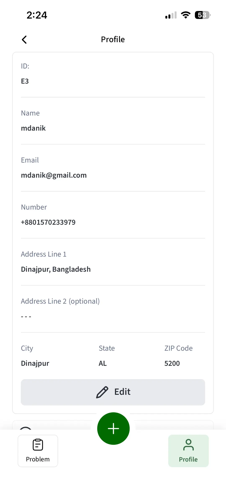
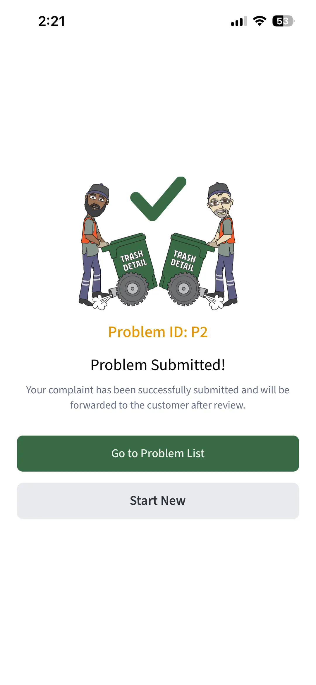

# 🚛 Trash Detail — Smart Waste Management & Problem Reporting

[](https://reactnative.dev/)
[](https://expo.dev/)
[](https://www.typescriptlang.org/)
[](https://www.nativewind.dev/)
[](https://redux-toolkit.js.org/)
[](https://socket.io/)

**Trash Detail** is a multi-role, real-time waste management and problem tracking mobile application built with React Native and Expo. It bridges communication gaps between field waste collection personnel, customers, and administrative management teams by enabling instant photo-documented issue reporting and live support tracking.

---

## 📲 Download the App

[](https://apps.apple.com/au/app/trash-detail/id6762623763)
[](https://play.google.com/store/apps/details?id=com.caitlan.trashdetail)

---

## 📱 App Screenshots

|                       🔐 Login & Authentication                        |                        📸 Guided Problem Capture                         |                            👤 User Profile                             |                               🎉 Problem Submitted                                |
| :--------------------------------------------------------------------: | :----------------------------------------------------------------------: | :--------------------------------------------------------------------: | :-------------------------------------------------------------------------------: |
|  |  |  |  |
|      **Secure Authentication**<br/>Email/Password & Role routing       |     **Step 1/4: Camera Capture**<br/>Instant photo evidence logging      |      **User Profile Management**<br/>Role details & account info       |            **Instant Confirmation**<br/>Unique ID generation (e.g. P2)            |

---

## ✨ Key Features

### 🚛 1. Guided Problem Reporting & Documentation

- **4-Step Wizard**: Streamlined reporting workflow (`Capture Photo` ➔ `Problem Details` ➔ `Select Customer` ➔ `Overview`).
- **In-App Camera & Gallery**: Native camera capture powered by `expo-camera` with built-in image compression and manipulation (`expo-image-manipulator`).
- **Cloudinary Integration**: Automated image uploading to Cloudinary for reliable remote storage and URL distribution.
- **Categorization**: Report issues such as blocked bins, parked cars blocking dumpsters, locked gates, overflowing waste, or road construction.

### 👥 2. Multi-Role Operating System

- **👷 Employees**: Document field collection obstacles, track report progress, and receive live notifications on problem resolution.
- **🏘️ Customers**: View logged issues affecting their premises, track progress, and communicate directly with support teams.
- **🛡️ Admins & Super Admins**: Operational dashboard to view, review, forward, or cancel reported problems, manage user permissions, and invite new members.

### 💬 3. Real-Time Chat & Support System

- **Socket.io Integration**: Low-latency, bidirectional WebSocket connection for live messaging.
- **Dedicated Chat Threads**: Separate communication channels for problem resolution and customer support requests.
- **Rich Status Alerts**: Real-time read receipts, unread message badges, and instant toast notifications via `@baronha/ting`.

### 🔐 4. Authentication & Security

- **JWT & Role-Based Navigation**: Protected routes auto-filtered by user role using Expo Router layouts (`(auth)`, `(employee)`, `(customer)`, `(admin)`).
- **Password Recovery & OTP**: Password reset flow with verification code support.

---

## 🛠️ Tech Stack

| Domain                      | Technology / Library                                                                                       |
| :-------------------------- | :--------------------------------------------------------------------------------------------------------- |
| **Framework**               | [React Native 0.81.5](https://reactnative.dev/) with [Expo SDK 54](https://expo.dev/)                      |
| **Routing**                 | [Expo Router v6](https://docs.expo.dev/router/introduction/) (File-based routing & role groups)            |
| **Language**                | [TypeScript 5.9](https://www.typescriptlang.org/)                                                          |
| **Styling**                 | [NativeWind v4](https://www.nativewind.dev/) & [TailwindCSS v3](https://tailwindcss.com/)                  |
| **State Management**        | [Redux Toolkit](https://redux-toolkit.js.org/) & RTK Query (`@reduxjs/toolkit`)                            |
| **Persistence**             | [`@react-native-async-storage/async-storage`](https://react-native-async-storage.github.io/async-storage/) |
| **Real-Time Communication** | [Socket.io Client v4](https://socket.io/)                                                                  |
| **Media & Native Hardware** | `expo-camera`, `expo-image-picker`, `expo-image-manipulator`, `expo-location`                              |
| **Notifications & Toasts**  | `@baronha/ting` & `expo-haptics`                                                                           |

---

## 📂 Project Structure

```text
trash-detail/
├── app/                        # Expo Router file-based pages & route groups
│   ├── (admin)/                # Admin portal routes & tab navigation
│   ├── (auth)/                 # Authentication screens (login, register, forgot/reset password)
│   ├── (customer)/             # Customer portal routes & tab navigation
│   ├── (employee)/             # Employee portal routes (problem creation wizard & tabs)
│   ├── shared/                 # Shared screen components (e.g. Notifications)
│   ├── _layout.tsx             # Root layout & Redux / Navigation providers
│   └── index.tsx               # App entry redirect handler
├── assets/                     # Media & design assets
│   ├── images/                 # App icons, splash screens, & vector graphics
│   └── screenshots/            # Documentation & README screenshots
│       ├── 1.webp              # Login screen
│       ├── 2.webp              # Camera capture step
│       ├── 3.webp              # User profile
│       └── 4.webp              # Submission confirmation
├── components/                 # Reusable React components split by domain
│   ├── admin/                  # Admin-specific components
│   ├── auth/                   # Authentication forms & inputs
│   ├── customer/               # Customer views & cards
│   ├── employee/               # Problem reporting steps & employee UI
│   └── shared/                 # Shared UI elements (headers, buttons, modals)
├── constants/                  # Color tokens, roles, step definitions, state constants
├── hooks/                      # Custom React hooks (Redux typed hooks, socket listeners)
├── scripts/                    # Build & automation scripts (e.g. Android AAB signer)
├── store/                      # Redux store configuration & RTK Query API slices
│   ├── slices/                 # API slices (auth, admin, employee, customer, chat, notification)
│   └── store.ts                # Main store configuration
├── types/                      # TypeScript declarations (API schemas, components, models)
└── utils/                      # Helper utilities (time formatting, Cloudinary uploader)
```

---

## 🚀 Getting Started

### Prerequisites

Ensure you have the following installed on your machine:

- **Node.js**: `v18.x` or higher
- **npm** / **yarn** / **pnpm** / **bun**
- **Expo Go** app on your mobile device (or Android Studio / Xcode for emulators)

### Installation

1. **Clone the repository**:

   ```bash
   git clone https://github.com/xyryc/trash-detail.git
   cd trash-detail
   ```

2. **Install dependencies**:

   ```bash
   npm install
   ```

3. **Configure Environment Variables**:
   Create a `.env` file in the root directory based on `.env.example`:

   ```env
   EXPO_PUBLIC_API_URL=https://your-api-endpoint.com/api
   EXPO_PUBLIC_SOCKET_URL=https://your-api-endpoint.com
   EXPO_PUBLIC_CLOUDINARY_CLOUD_NAME=your_cloudinary_cloud_name
   EXPO_PUBLIC_CLOUDINARY_UPLOAD_PRESET=your_upload_preset

   # Android Signing Credentials (Optional for local development)
   ANDROID_KEYSTORE_FILE=upload-keystore.jks
   ANDROID_KEY_ALIAS=upload
   ANDROID_KEYSTORE_PASSWORD=your_keystore_password
   ANDROID_KEY_PASSWORD=your_key_password
   ```

---

## 🏃 Running the Application

### Development Server

Start the Expo bundler:

```bash
npm start
# or
npx expo start
```

From the terminal menu, you can press:

- `a` to open in **Android Emulator**
- `i` to open in **iOS Simulator**
- `w` to open in **Web Browser**
- Scan the QR code with **Expo Go** on your physical device

### Platform Specific Commands

| Target Platform | Command           | Description                                   |
| :-------------- | :---------------- | :-------------------------------------------- |
| **Android**     | `npm run android` | Runs app on connected Android device/emulator |
| **iOS**         | `npm run ios`     | Runs app on iOS simulator                     |
| **Web**         | `npm run web`     | Launches local web development server         |
| **Linter**      | `npm run lint`    | Runs Expo ESLint checks                       |

---

## 📦 Production Builds & Android AAB Release

This project includes an automated script (`scripts/build-android-aab-signed.mjs`) to generate signed **Android App Bundles (.aab)** ready for Google Play Store upload.

### Building Signed Android AAB

1. **Ensure environment variables are configured**:

   ```bash
   export ANDROID_KEYSTORE_FILE="upload-keystore.jks"
   export ANDROID_KEYSTORE_PASSWORD="your_keystore_password"
   export ANDROID_KEY_ALIAS="upload"
   export ANDROID_KEY_PASSWORD="your_key_password"
   ```

2. **Execute the build script**:

   ```bash
   npm run android:aab
   ```

   _The generated signed bundle will be available at:_
   `android/app/build/outputs/bundle/release/app-release.aab`

3. **Verification Utilities**:
   - **Check keystore details**:
     ```bash
     keytool -list -v -keystore upload-keystore.jks -alias "$ANDROID_KEY_ALIAS"
     ```
   - **Verify AAB Signature**:
     ```bash
     jarsigner -verify -verbose -certs android/app/build/outputs/bundle/release/app-release.aab
     ```
   - **Generate Gradle Signing Report**:
     ```bash
     npm run android:signingReport
     ```

---

## 📜 Available Scripts

| Command                         | Action                                       |
| :------------------------------ | :------------------------------------------- |
| `npm start`                     | Starts the Expo Metro bundler                |
| `npm run android`               | Compiles & launches native Android dev build |
| `npm run ios`                   | Compiles & launches native iOS dev build     |
| `npm run web`                   | Launches Expo web dev server                 |
| `npm run lint`                  | Runs ESLint analysis                         |
| `npm run android:aab`           | Builds a signed Android App Bundle (.aab)    |
| `npm run android:signingReport` | Outputs Gradle signing certificate details   |
| `npm run reset-project`         | Resets project to a blank starter template   |

---

## 🤝 Contributing

Contributions are welcome! Please follow these steps:

1. Fork the repository.
2. Create a feature branch (`git checkout -b feature/AmazingFeature`).
3. Commit your changes (`git commit -m 'Add some AmazingFeature'`).
4. Push to the branch (`git checkout -b feature/AmazingFeature`).
5. Open a Pull Request.

---

## 📄 License

This project is proprietary and confidential. All rights reserved.
